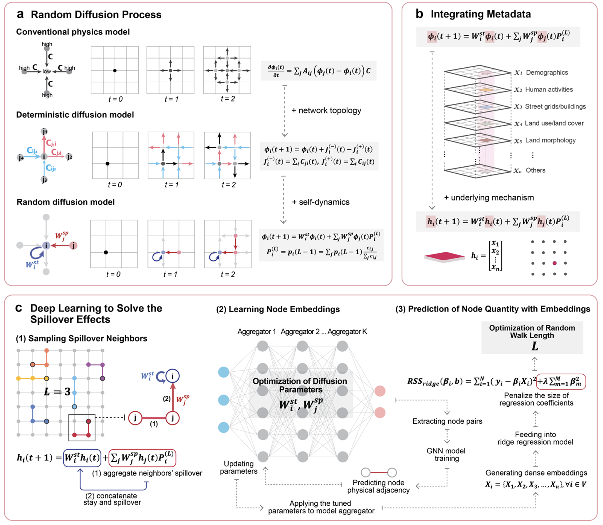
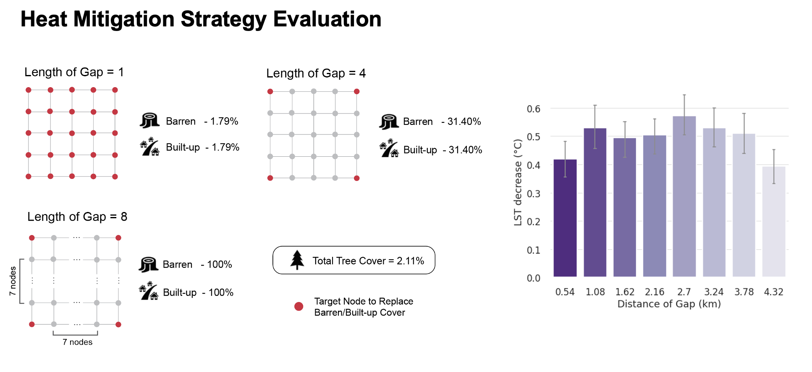
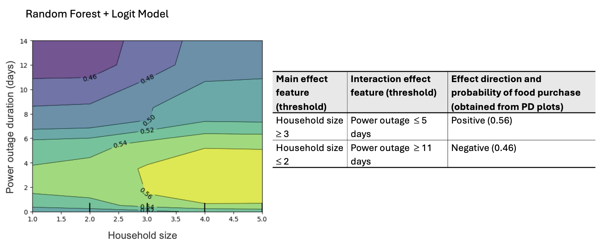

## Hi, I'm Tong Liu 👋✨

I am a multidisciplinary researcher working at the intersection of transportation systems, disaster resilience and human behavioral choice modeling. My work focuses on quantitative risk modeling, scenario-based evaluation and decision support for complex infrastructure and urban systems, with applications spanning disaster adaptation and real-world operations. I hold a Ph.D. in Civil Engineering (Transportation), an M.S. in Computer Science and an M.L.A in Landscape Architecture. This background shapes how I think about infrastructure, environment and human behavior as interconnected systems rather than isolated individual components. I currently work at an engineering consulting company, where I develop AI- and data-driven decision-support tools for transportation and public-sector applications. 

### 🎓 Research & Technical Focus
- 🛣️ Transportation system risk analytics and risk-aware asset management
- 👯 Human-centered disaster resilience and adaptation
- 🚨 Evacuation, mobility, and adaptation behavior under disruptions
- 🌦️ Scenario-based evaluation and decision-making analytics
- 📈 Interpretable machine learning for complex urban system simulation

### 🧰 Methods & Skills
** 🤖 Machine Learning & AI**  
- Interpretable ML, predictive modeling, time-series analysis, Tree-based ML
- Deep learning (CNNs, RNNs, GNNs, Transformers)
- Risk prediction and explainable AI
- Behavioral choice modeling

** 📊 Data Science & Analytics**
- End-to-end data pipelines (data collection → modeling → evaluation → deployment)  
- Feature engineering and large-scale data processing 
- Model validation and performance assessment

** 💻 Programming & Tools**  
- Python, SQL, JavaScript, C/C++
- Geospatial analytics (GIS, Google Earth Engine, spatial data processing)  
- Data visualization and reproducible research workflows  

---

## ✨ Research Highlights ✨
### Urban spillover modeling
Physics-informed deep learning framework for quantifying nonlocal spillover effects in urban systems.  

### Heat mitigation scenario evaluation
Scenario-based evaluation of urban tree-cover placement and projected land surface temperature reduction.  

### Household adaptation behavior under disruptions
Behavioral choice modeling and analysis under disruptive conditions (e.g., road closure, power outage).  

<!--
**tongliu0/tongliu0** is a ✨ _special_ ✨ repository because its `README.md` (this file) appears on your GitHub profile.

Here are some ideas to get you started:

- 🔭 I’m currently working on ...
- 🌱 I’m currently learning ...
- 👯 I’m looking to collaborate on ...
- 🤔 I’m looking for help with ...
- 💬 Ask me about ...
- 📫 How to reach me: ...
- 😄 Pronouns: ...
- ⚡ Fun fact: ...
-->
